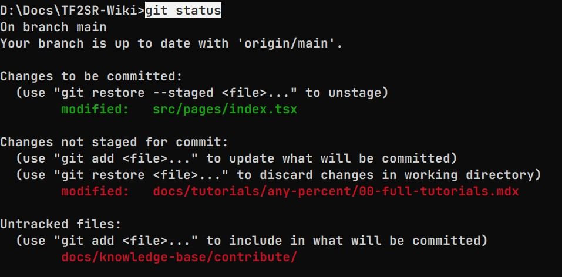
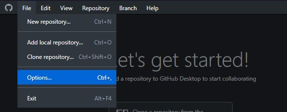

# ⌨ The hackerman way

:::caution under construction lol!
please go to [the shrimple way](easy-way) instead of this for now
:::

Unless you suffer from programmer brain, contributing to the wiki is unfortunately not a very straight forward process. It requires the use of a handful of tools that are made by programmers, for programmers, which makes them a bit of a pain to setup and use for the average person.

:::info
The goal of this contribution guide is to walk you through the entire process step-by-step, while attempting to explain the tools you will be using so you (hopefully) don't feel like you're blindly installing random programs.
:::

## First steps on GitHub

Since the source code for this wiki is hosted on GitHub, that's where our first few steps begin.

## The tools you'll need (and why)

- [GitHub Desktop](https://desktop.github.com)
- [NodeJS](https://nodejs.org/en)
- [Visual Studio Code](https://code.visualstudio.com/)

...ok but like why?

### Git

**Git** is the tool that enables us to collaborate on this wiki. It lets us save a version history of all our files and sync the changes we make locally to the central repository that's hosted on GitHub. We'll talk more about *how* to use Git and how it works in the chapter about making your changes. For now, let's just focus on getting it set up.

What makes Git a little confusing is that there are a lot of different versions out there. [The OG Git](https://git-scm.com) is actually just a command-line tool, meaning you open up a terminal, type in `git` followed by some commands that tell the program what you want it to do.

And while that's great for a lot of programmers, it's terribly unusable for literally everyone else. That's why third parties have brought it upon themselves to create their own Git clients that actually look like apps that humans might use. For this guide we'll be using [GitHub Desktop](https://desktop.github.com) because it integrates quite smoothly with GitHub itself, which is where we host the source code for this wiki.

:::note
You can of course use other Git clients like [Sublime Merge](https://www.sublimemerge.com/) or [GitKraken](https://www.gitkraken.com/), or even the original [Git](https://git-scm.com) if you hate yourself. They will all do what you need them to do, because we will only be using the *very* fundamental features of Git.
:::

Upon opening GitHub Desktop for the first time, you might get prompted to connect your GitHub Account with the app. If you not, you can do so manually via File > Options, then you should see the 'Sign In' button right at the top of the Accounts tab.

 

What we want to do now is `clone` the main repository onto our local drive.