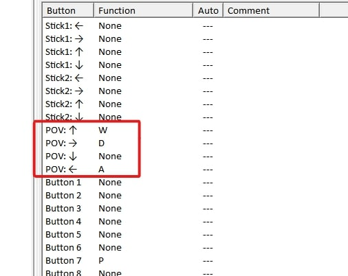

import {YouTube} from 'mdx-embed';

# Lurch on controller

**This will only work on PC**, as it requires [JoyToKey](https://joytokey.net/en/download), which is a software that emulates keyboard and mouse key presses/movement on a PC gamepad.

:::note
You can use this software to be able to perform lurch tech (tapstrafing, fzzystrafing) on controller, however there are a few rules to keep in mind here.

* Analog to digital (binding analog stick to WASD) is **illegal for leaderboard runs** because it is considered as a macro.
* Only single inputs on controller to single inputs on keyboard and mouse are allowed, for example: _A button_ -> _Space bar_.
:::

So now that you have downloaded JoyToKey, make a profile and plug in your controller.

The most optimal bind for WASD so far has been the D-pad, since you rarely use it in the speedrun and because it has 4 buttons that point in all 4 directions.

:::tip 
You will find what buttons you will have to bind if you press them on your controller while JoyToKey is open, as they will get highlighted in yellow.
:::

These are the buttons you want to bind:

You only want to bind WAD since these are the only directions you will need for lurch tech.

:::note

If you are using a regular controller, you are likely gonna have to use a claw grip to be able to perform lurch tech efficiently, however, if you have paddles or extra buttons on your controller, you can create a more comfortable layout that fits you best.

:::

Here is what it should look like if you have done everything right:
<YouTube youTubeId="0oBhBRIKHtI"/>