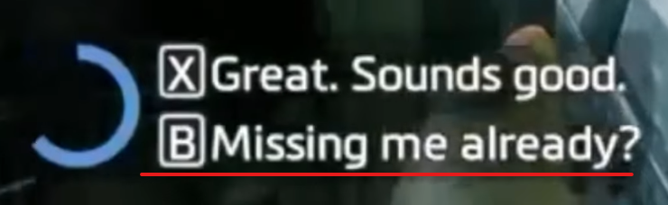
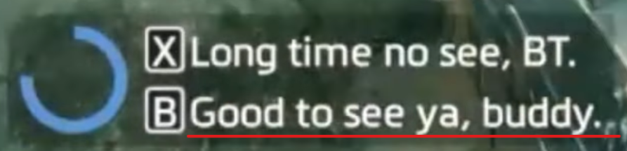

import {YouTube} from 'mdx-embed';

# 🩸 Blood & Rust

## Intro

:::diffe

### Disembark Jump

<YouTube youTubeId="awwGNJEkU_o"/>

:::

:::diffm

### Early Disembark

<YouTube youTubeId="Kkz2RaXrDOU"/>

:::

:::diffh

### Instant Disembark
**AKA:** Vizembark, Decembark
<YouTube youTubeId="ycgXzdBuP1o" />

#### Note!

When doing Instant Disembark, you will have to fight Kane with Expedition due to skipping the Tone Loadout. Expedition is about 5 seconds slower than Tone, so you'll want to be at least that much faster to save time with this route.

:::

## Control Room

:::diffe

### Simple Prespeed

<YouTube youTubeId="U1m-qm0FDdk" />

:::

:::diffm
### Frag Boost
<YouTube youTubeId="cYF3sqGzpmM" skipTo={{ h:0, m:9, s:38 }} />
:::

:::diffh

### Frag Prespeed

<YouTube youTubeId="cYF3sqGzpmM" skipTo={{ h:0, m:16, s:0 }} />
:::

## Barry Bridge

:::diffe

### Barry Bridge

<YouTube youTubeId="ZQ0XegVAt8k" />

:::

:::diffm

### Barry Blast

<YouTube youTubeId="EJFt8UbAdfA" />

:::

## Sniper Canal

:::diffe

### Left Side route

<YouTube youTubeId="96kcZEHf9ls" />

:::diffm

### Sniper Canal Crouch Kicks

<YouTube youTubeId="LcZiwkyoGZ0" />

:::

## Snake hallway

## Big door

- normal slide

- Frag strat

- Different Prespeeds with or w/o frag

## Grunt hallways

- Slingshot [?]

[some strats are missing i think but i forgor -mats]

## Sludgefall

:::diffe

### Bump Launch
<YouTube youTubeId="cYF3sqGzpmM" skipTo={{ h:0, m:4, s:43 }} />
:::

## Pipe hallway

:::diffm
<YouTube youTubeId="cYF3sqGzpmM" skipTo={{ h:0, m:11, s:50 }} />
:::

## Buttons
:::diffe
### Basic Route
<YouTube youTubeId="cYF3sqGzpmM" skipTo={{ h:0, m:5, s:19 }} />
:::

:::diffm
### Frag Boost
<YouTube youTubeId="cYF3sqGzpmM" skipTo={{ h:0, m:12, s:16 }} />
:::

:::diffh
Depending on how many frags you are implementing in your run, you might need to grab some additional ones from the box right before the first set of doors.
:::

## Sludge Skip

:::caution
### Avoiding a crash
When performing sludge skip, if you embark on BT before he finishes talking the game will crash. However, if we take too long he will start to run away, making it impossible to embark through the fence.
Because of this, we have to manipulate the dialog options so that BT finishes talking before we reach him but not so early that he starts run away:

As you reach the door with the first button, choose the second dialog option.

As you press the last button before sludge skip, choose the second dialog option.

Depending on how fast you are able to perform sludge skip, you will have to play with the timing of the second dialog. If you're faster, you can get away with pressing it earlier and if you're slower you'll have to delay it a bit. If get to BT before he finishes talking, you can simply wait until he's done before you embark.

:::

:::diffe
### Safe Setup
<YouTube youTubeId="cYF3sqGzpmM" skipTo={{ h:0, m:5, s:28 }} />
:::

:::diffm
### Standard Route
<YouTube youTubeId="cYF3sqGzpmM" skipTo={{ h:0, m:12, s:49 }} />
:::

:::diffh
### Mantle-less Sludge Skip
<YouTube youTubeId="cYF3sqGzpmM" skipTo={{ h:0, m:17, s:27 }} />
:::

## Kane Runup

:::diffe

### Titan movement

<YouTube youTubeId="s3vMqJvku0I" />

:::

:::diffh

### Pilot Transition

Only do this if you already do Vizembark (not confirmed) -mats

<YouTube youTubeId="cYF3sqGzpmM" skipTo={{ h:0, m:17, s:35 }} />
:::

## Kane fight

:::note

If you picked up Tone, it is optimal to use it in the fight. 

However, if you performed *Instant Disembark*, you need to fight Kane with Expedition because you didn't pick up Tone. Expedition is about five seconds slower than Tone.

:::

### Tone

:::diffe

<YouTube youTubeId="BbVOCwiXzlw" />

I briefly mention in the video that sometimes Kane stays on the stage at the back of the arena, and it stops him from moving around. At the end of the video, I included an example of it happening. You can see that Kane barely moves around or fights back at all when this happens, so if you can manipulate him to stay on top of the stage, that is ideal. 

:::

### Expedition

:::diffe

<YouTube youTubeId="cYF3sqGzpmM" skipTo={{ h:0, m:18, s:31 }} />

:::
