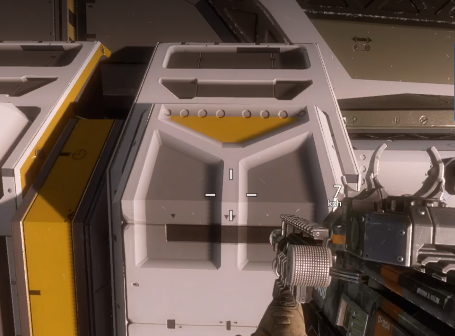

import {YouTube} from 'mdx-embed';

# The Ark

:::tip Note
This level fucking sucks
:::

## Starting Cutscene
As soon as the level starts, return to menu if you havent already done so in Beacon 1. Menuing in EnC1 will not give you the Ion Titan loadout required to do viper zerg.

Once you reload into the level, throw a frag off of the ship you are on. When the cutscene ends, it will refill your grenade stock, but only if you are empty.

It's best not to shoot for no reason, or even slide along the ship, as this could sometimes bug the game and cause you to die (ark moment)

## Barker & 6-4

:::diffe

### Standard Route

Simply wait for BT to allow you to fastball onto the 6-4's ship, and jump when the 6-4 say to.
:::

:::diffm
### Barker Skip

#### Blaidan's Method

When you land on Barker's ship, immediately go to the "hump" in the middle of the ship, and lines yourself up so that the spitfire's bottom crosshair is between 2 of the black markings that look like arrows pointing downward.

Then pay attention to the dialogue and wait for the Crow CPT to say "Commander Briggs", then in the middle of the pause from the comma, start to pull a frag. As you pull the frag, look at your crosshair, and note how spread apart the crosses are fron the center. Wait for it to "breathe" once (so that it ends up at the same position it was initially), then drop it by using your scroll wheel to swap to another weapon. Walk backwards a small bit and then run forwards and immediately slide. Jump before you fall into the slant below and this should allow you to get boosted from the grenade reliably. 

#### Bryonato's Method

I forgor

Note: There are different seeds for the ship's movement, meaning it will sometimes be much easier to make it to the 6-4 and sometimes even be nearly impossible. 
:::

:::diffe
### 6-4 Skip

As you land on the 6-4, stand at the edge of the right wing to avoid falling through and dying. The 6-4 will start to strafe left; as they start to level out, approach the front of the ship. When they are completely level, slide off the ship without jumping. Double jump as early as possible to avoid getting killed by the fall timer, which kills you after you are falling for too long.  

:::

## The Malta

Make your way to the elevator on the opposite side of the entrance and jump over the grunts coming out. Slide out of the elevator when it opens and slide hop over to the third gun battery; the first two do not need to be cleared to progress the mission, as long as the third one is cleared fast enough. Start cooking a frag as you are on the wall between the 2nd and 3rd gun battery and throw it between the gunner and the close grunt on his right. Take out the rest of the grunts with the mastiff, making sure to keep double jumping to avoid the scripted stagger that occurs. Once the 6-4 board the ship, choose the top dialogue option (Good covering fire). Stand on the corner of the guardrails where it bends.

## The Malta Room Clear

As Sarah starts to rise, run off of the rails and strafe to make it to the top of Sarah's ship. Wait for the ship's movement to start stabilizing before sliding onto the side of the Malta. Start to pull a frag just before you slide off and throw it down onto the left side of the group of grunts below. Pull another frag and throw it to the other side. Pick up any firestars if possible