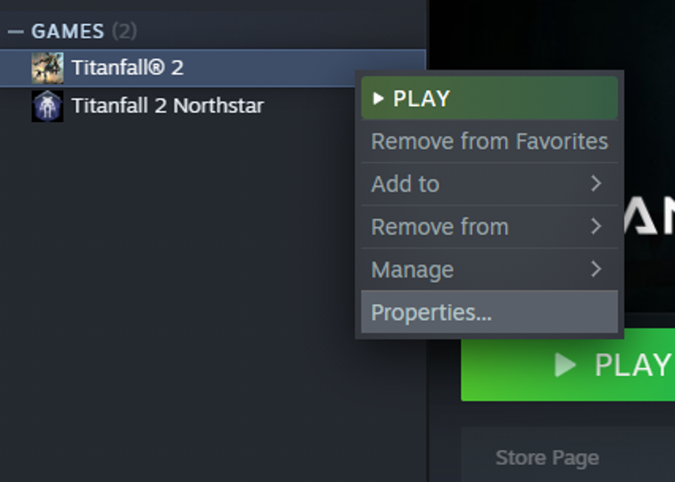
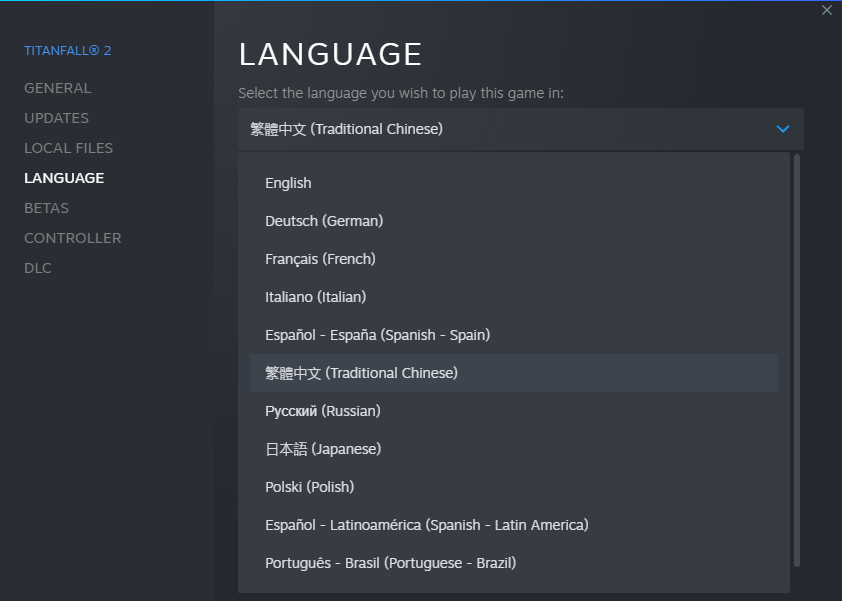

# 🔧 Additional tools

Let's start with some free timesave. Many of the cutscenes in Titanfall 2 work in such a way that if a voice acted line is shorter, the next one plays earlier, speeding up the cutscene. The fastest language thereby is Mandarin (called Traditional Chinese in the language settings) by about 38 seconds.

## Changing Languages

**On Steam,** you simply right click the game in your games list, hit _Properties_ and then select Traditional Chinese under the dropdown in the _Language_ tab.

**The EA App** currently does not have a way of changing languages, so you'll have to swap out the files manually. Here's how to do it:

1. Download the [language files](https://drive.google.com/file/d/1Q9BQiJ2nVWffmbKgzgp4bTolsfBtlCyM/view) (This zip includes the files for CHI, ENG and GER)
2. Extract the files somewhere (Ideally keep a backup of the ENG files in case you want to switch back at some point)
3.  Go to your Titanfall install directory under `r2/sound` and move out or delete all files that start with `general_<WhateverLanguageYouHadInstalled>` (do **not** touch the `general_stream` files)&#x20;

    <figure><figcaption>
The highlighted files are the ones you want to replace
</figcaption></figure>
4. Move all files from the `CHI` directory in the zip you downloaded into the game's `r2/sound` folder

**On Console,** you have to set your entire console's language to chinese in order for the game to adapt that language. Here is Doakey's Console setup tutorial (again) with a timestamp to the section on how to change languages on both Xbox and PS4:



One downside to switching the game language is that now the menu text is also all in chinese, so you'll have to memorize the positions or input sequences for all of the commonly used menu options like Reload Last Checkpoint, Restart Level, Change Difficulty and Start New Game.

If you're on PC though, you can have the faster mandarin dialog while still keeping the _menu text_ in english by installing the community's Speedrunning mod.

## Speedrun Mod

PC runners have access to the [Speedrunning mod](https://github.com/zweek/TF2SR-Menu-Mod), which includes a bunch of practice tools, Quality-of-Life options and fixes to make your time running the game a bit easier. You can find the most recent download on the [releases tab](https://github.com/zweek/TF2SR-Menu-Mod/releases).

The file you'll most likely want to download is `SRMM-<versionNumber>-main.zip`.\
If you happen to speak mandarin and want the tools the mod provides _without_ switching out the chinese text for english text, you can download the `SRMM-<versionNumber>-this-version-is-for-chinese-runners-who-want-to-keep-their-game-text-in-chinese-instead-of-swapping-it-out-for-english-text.zip`. Yes, that is the actual name.

Installing SRMM is as simple as dragging and dropping everything from the downloaded zip into your main Titanfall2 install directory. You'll know you did it correctly when you're greeted by an orange `SRMM <someVersionNumber>` below the game title on the main menu screen.
